## Part 1. Инструмент **ipcalc**
    sudo apt install ipcalc
    ipcalc

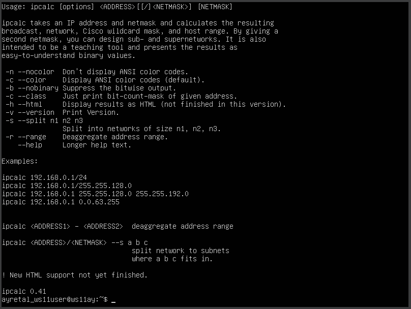

#### 1.1. Сети и маски

#### 1) Адрес сети *192.167.38.54/13*
Смотрим на строку Network

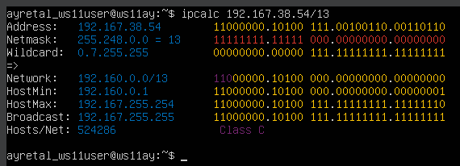


##### 2) Перевод маски *255.255.255.0* в префиксную и двоичную запись, */15* в обычную и двоичную, *11111111.11111111.11111111.11110000* в обычную и префиксную

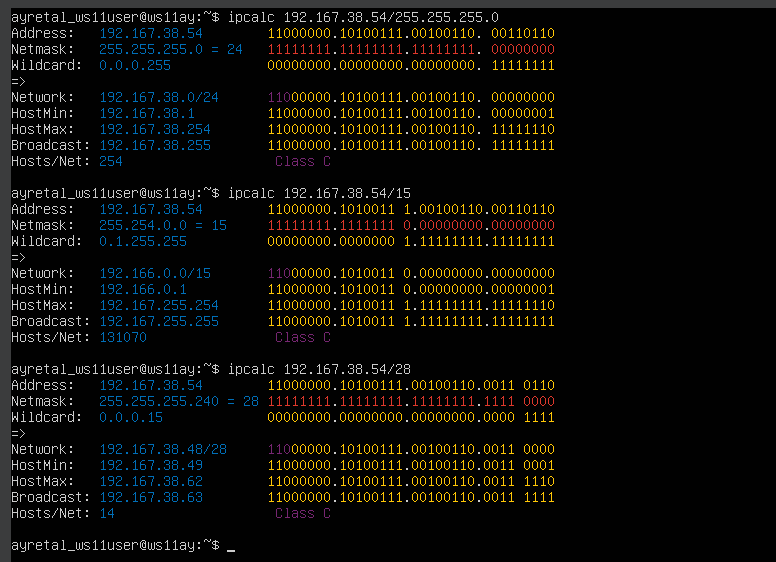

##### 3) Минимальный и максимальный хост в сети *12.167.38.4* при масках: */8*, *11111111.11111111.00000000.00000000*, *255.255.254.0* и */4*

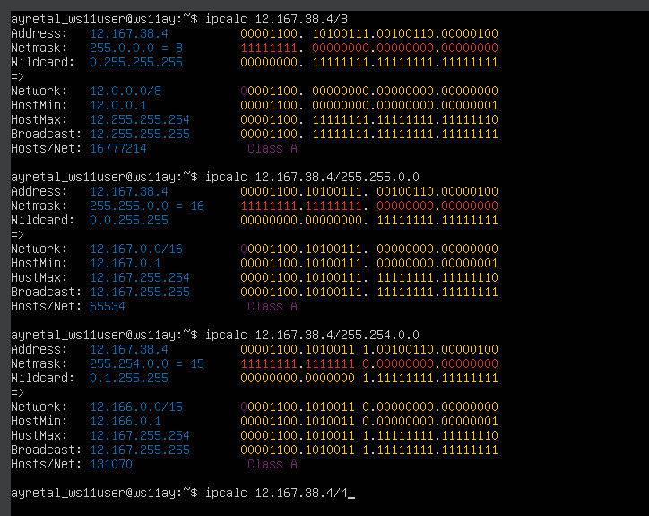

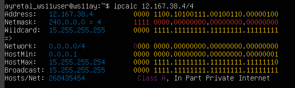

#### 1.2. localhost
##### Определи и запиши в отчёт, можно ли обратиться к приложению, работающему на localhost, со следующими IP: *194.34.23.100*, *127.0.0.2*, *127.1.0.1*, *128.0.0.1*

Localhost - это имя хоста, которое относится к компьютерной системе, на которой запущена вызывающая программа, что означает, что машина будет разговаривать сама с собой, когда мы вызываем localhost.

Это помогает нам проверять сетевые службы на машине даже во время сбоев сетевого оборудования. При использовании “localhost” доступ к сетевым службам осуществляется через логический сетевой интерфейс, называемый loopback.


    localhost - "общеизвестное" имя компа для самого себя и ему соответствует IP адрес 127.0.0.1. 
    Это - общепринятая договоренность, которую просто нужно знать. Если говорят
    "установить сервер на localhost", это означает "установить на тот самый комп, 
    с которого и обращаться к этому серверу".

    194.34.23.100 - нет
    127.0.0.2 - да
    127.1.0.1 - да
    128.0.0.1 - нет


#### 1.3. Диапазоны и сегменты сетей
##### Определи и запиши в отчёт:
##### Что такое общедоступный IP-адрес
Общедоступный IP-адрес – это IP-адрес, к которому можно получить доступ напрямую через Интернет и который назначается вашему сетевому роутеру вашим интернет-провайдером (ISP). Ваше личное устройство также имеет частный IP-адрес, который остаётся скрытым, когда вы подключаетесь к Интернету через общедоступный IP-адрес роутера.

Использование общедоступного IP-адреса для подключения к Интернету похоже на использование почтового ящика для обычной почты, а не на предоставление вашего домашнего адреса. Это немного безопаснее, но гораздо более заметно.

##### Что такое частный IP-адрес
Частный IP-адрес – это адрес, который сетевой роутер назначает вашему устройству. Каждому устройству в одной сети назначается уникальный частный IP-адрес (иногда называемый частным сетевым адресом) – так устройства в одной внутренней сети общаются друг с другом.

Частные IP-адреса позволяют устройствам, подключенным к одной сети, взаимодействовать друг с другом, не подключаясь ко всему Интернету. Затрудняя установление соединения внешним хостом или пользователем, частные IP-адреса помогают повысить безопасность в определенной сети, например, в вашем доме или офисе. Вот почему вы можете печатать документы через беспроводное соединение на своем домашнем принтере, но ваш сосед не может случайно отправить свои файлы на ваш принтер.


##### Диапазоны общедоступных и частных IP-адресов
Ваш частный IP-адрес существует в определенных диапазонах частных IP-адресов, зарезервированных Управлением по присвоению номеров в Интернете (IANA), и никогда не должен появляться в Интернете. По всему миру существуют миллионы частных сетей, каждая из которых включает устройства, которым назначены частные IP-адреса в следующих диапазонах:

    Класс А: 10.0.0.0 – 10.255.255.255
    Класс Б: 172.16.0.0 – 172.31.255.255
    Класс С: 192.168.0.0 – 192.168.255.255

Определи и запиши в отчёт:

1) Какие из перечисленных IP можно использовать в качестве публичного, а какие только в качестве частных: 10.0.0.45, 134.43.0.2, 192.168.4.2, 172.20.250.4, 172.0.2.1, 192.172.0.1, 172.68.0.2, 172.16.255.255, 10.10.10.10, 192.169.168.1

|       Ip       |        res        |
| :------------: | :----------------: |
|   10.0.0.45   |   частный   |
|   134.43.0.2   | публичный |
|  192.168.4.2  |   частный   |
|  172.20.250.4  |   частный   |
|   172.0.2.1   | публичный |
|  192.172.0.1  | публичный |
|   172.68.0.2   | публичный |
| 172.16.255.255 |   частный   |
|  10.10.10.10  |   частный   |
| 192.169.168.1 | публичный |

2) Какие из перечисленных IP адресов шлюза возможны у сети 10.10.0.0/18: 10.0.0.1, 10.10.0.2, 10.10.10.10, 10.10.100.1, 10.10.1.255

##### Шлюз
Шлюз-это сетевое устройство, которое действует как точка входа из одной сети в другие сети. Хост отправляет в сетевой шлюз по умолчанию (в частности, на IP-адрес сетевого шлюза) все пакеты, направленные на другие хосты вне локальной сети, что означает, что хост без указанного адреса шлюза по умолчанию может обмениваться пакетами только с компьютерами в той же локальной сети.

В связи с распространением сети TCP/IP понятие сетевого шлюза стало практически тождественным маршрутизатору. Шлюз создается на границе сети для управления всеми данными, которые обмениваются между внутренней сетью и внешними сетями. Как правило, для простых домашних сетей шлюз действует как защита для локальной сети, связывая его с общедоступными сетями. При установке IP-адреса для сетевого шлюза (со стороны локальной сети) чаще всего используется первый доступный адрес из пула адресов хостов, доступных в данной сети.

|       Ip       |        res        |
| :------------: | :----------------: |
|   10.0.0.1   |   нет   |
|   10.10.0.2   | да |
|   10.10.10.10  |   да   |
|   10.10.100.1  |   нет   |
|   10.10.1.255   | да |


## Part 2. Статическая маршрутизация между двумя машинами

##### Подними две виртуальные машины (далее -- ws1 и ws2).

##### С помощью команды `ip a` посмотри существующие сетевые интерфейсы.
- В отчёт помести скрин с вызовом и выводом использованной команды.

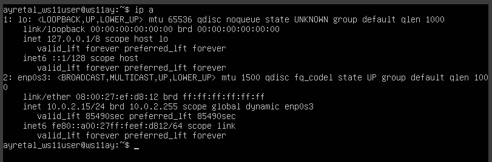

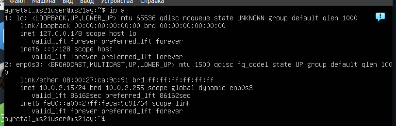

#### Опиши сетевой интерфейс, соответствующий внутренней сети, на обеих машинах и задать следующие адреса и маски: ws1 - *192.168.100.10*, маска */16*, ws2 - *172.24.116.8*, маска */12*.

lo (loopback device) – виртуальный интерфейс, присутствующий по умолчанию в любом Linux. Он используется для отладки сетевых программ и запуска серверных приложений на локальной машине. С этим интерфейсом всегда связан адрес 127.0.0.1. У него есть dns-имя – localhost. Посмотреть привязку можно в файле /etc/hosts.

    sudo vim /etc/netplan/00-installer-config.yaml

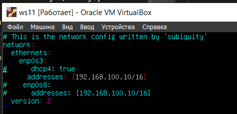

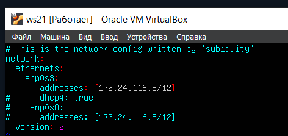

##### Выполни команду `netplan apply` для перезапуска сервиса сети.

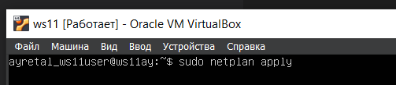

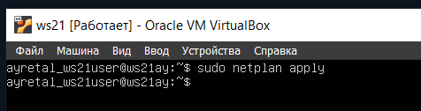

#### 2.1. Добавление статического маршрута вручную
#### Добавь статический маршрут от одной машины до другой и обратно при помощи команды вида `ip r add`.

    для ws11: sudo ip r add 172.24.116.8 dev enp0s3 
    для ws21: sudo ip r add 192.168.100.10 dev enp0s3

#### Пропингуй соединение между машинами.

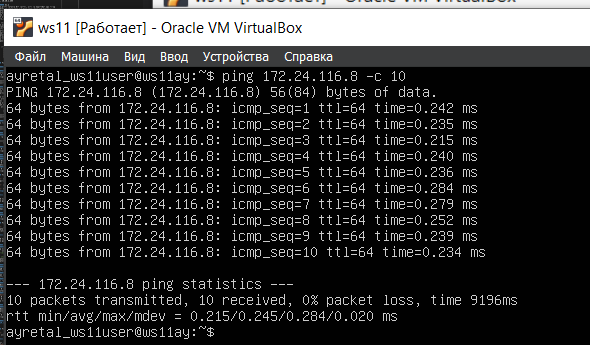

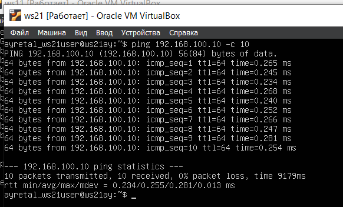

#### 2.2. Добавление статического маршрута с сохранением
##### Перезапусти машины.
##### Добавь статический маршрут от одной машины до другой с помощью файла *etc/netplan/00-installer-config.yaml*.
- В отчёт помести скрин с содержанием изменённого файла *etc/netplan/00-installer-config.yaml*.

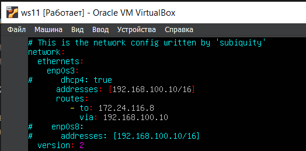

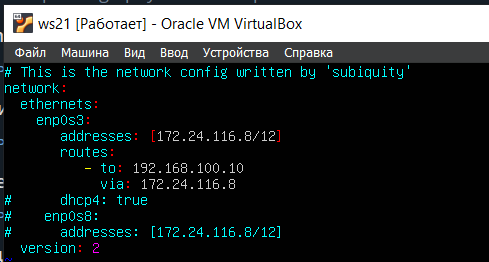

##### Пропингуй соединение между машинами.

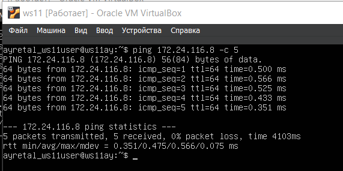

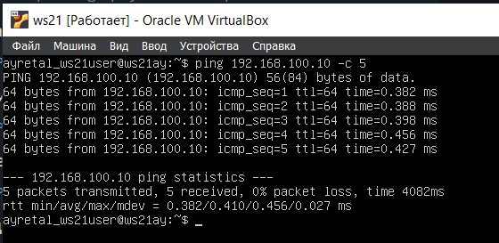

## Part 3. Утилита **iperf3**
Будем скорость соединения проверять с помощью утилиты **iperf3**.


#### 3.1. Скорость соединения
#### Переведи и запиши в отчёт: 8 Mbps в MB/s, 100 MB/s в Kbps, 1 Gbps в Mbps.

bps - bit for secondу

B - byte

8 Mbps = 1 MB/s

100 MB/s = 100 * 8 * 1024 Kbps = 819200 Kbps

1 Gbps = 1024 Mbps

#### 3.2. Утилита **iperf3**

    sudo apt install iperf3

Использование:

    iperf3 [-s | -c хост] [опции]

    -p, --port #	номер порта, на котором будет работать сервер/клиент (по умолчанию используется 5201)
    -f, --format [kmgKMG]	формат скорости в результатах теста: k (Кбит), K (Кбайт), m (Мбит), M (Мбайт), g (Гбит), G (Гбайт)
    -i, --interval #	интервал между выводом результата тестирования, в секундах
    -V, --verbose	более детализированный вывод информации
    -d, --debug	вывод дополнительной информации для отладки
    -v, --version	показать версию
    -h, --help	показать справку
    -s, --server	запуск сервера c отображением информации на экране
    -D, --daemon	запуск сервера в фоновом режиме, без отображения информации на экране; будет оставаться запущенным, даже после закрытия окна программы
    -c, --client <хост>	запуск клиента и подключение к серверу <хосту>
    -u, --udp	протокол UDP вместо TCP
    -b, --bandwidth #[KMG][/#]	максимальная скорость в битах/сек (0 - отсутствует ограничение); по умолчанию отсутствует ограничение скорости для TCP, а для UDP составляет 1 Мбит/сек (опция /# для пакетного режима передачи данных)
    -t, --time #	время тестирования в секундах (по умолчанию 10 сек)
    -n, --bytes #[KMG]	количество байт для передачи данных (вместо ключа -t)
    -l, --len #[KMG]	размер буфера (по умолчанию 128 КБ для TCP, 8 КБ для UDP)
    -P, --parallel #	число одновременных параллельных клиентских потоков
    -R, --reverse	запуск в обратном режиме (Reverse mode: сервер отправляет трафик, клиент принимает)
    -4, --version4	использовать только IPv4
    -6, --version6	использовать только IPv6
    -Z, --zerocopy	метод отправки данных по технологии zero copу для снижения нагрузки на процессор
    -O, --omit N	пропустить первые n секунд (игнорировать алгоритм TCP slowstart)
    --get-server-output	получить результаты с сервера

#### Измерь скорость соединения между ws1 и ws2.

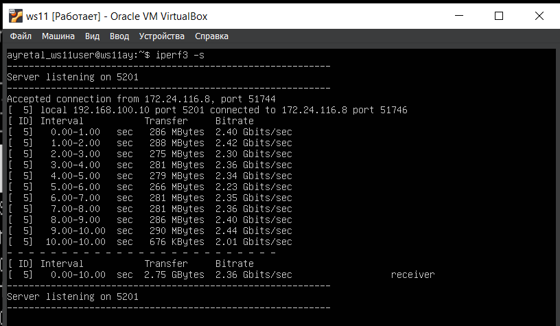
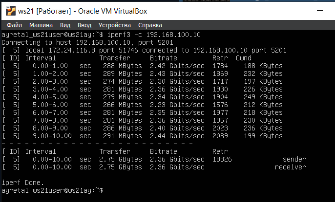

## Part 4. Сетевой экран

`-` После соединения машин перед нами стоит следующая задача: контролировать информацию, проходящую по соединению. Для этого используются сетевые экраны.

#### 4.1. Утилита **iptables**
##### Создай файл */etc/firewall.sh*, имитирующий фаерволл, на ws1 и ws2:
```shell
#!/bin/sh

# Удаление всех правил в таблице «filter» (по-умолчанию).
iptables -F
iptables -X
```
##### Нужно добавить в файл подряд следующие правила:
##### 1) На ws1 примени стратегию, когда в начале пишется запрещающее правило, а в конце пишется разрешающее правило (это касается пунктов 4 и 5).
##### 2) На ws2 примени стратегию, когда в начале пишется разрешающее правило, а в конце пишется запрещающее правило (это касается пунктов 4 и 5).
##### 3) Открой на машинах доступ для порта 22 (ssh) и порта 80 (http).
##### 4) Запрети *echo reply* (машина не должна «пинговаться», т.е. должна быть блокировка на OUTPUT).
##### 5) Разреши *echo reply* (машина должна «пинговаться»).
- В отчёт помести скрины с содержанием файла */etc/firewall* для каждой машины.
##### Запусти файлы на обеих машинах командами `chmod +x /etc/firewall.sh` и `/etc/firewall.sh`.
- В отчёт помести скрины с запуском обоих файлов;
- В отчёте опиши разницу между стратегиями, применёнными в первом и втором файлах.

iptables -t [таблица] [действие] [цепочка] [дополнительные_параметры]

таблица указывает таблицу, с которой нужно работать, этот параметр можно упустить, действие - нужное действие, например, создать или удалить правило, а дополнительные параметры описывают действие и правило, которое нужно выполнить.

Осталось рассмотреть основные действия, которые позволяет выполнить iptables:

    -A - добавить правило в цепочку;
    -С - проверить все правила;
    -D - удалить правило;
    -I - вставить правило с нужным номером;
    -L - вывести все правила в текущей цепочке;
    -S - вывести все правила;
    -F - очистить все правила;
    -N - создать цепочку;
    -X - удалить цепочку;
    -P - установить действие по умолчанию.

Дополнительные опции для правил:

    -p - указать протокол, один из tcp, udp, udplite, icmp, icmpv6,esp, ah, sctp,
    mh;
    -s - указать ip адрес устройства-отправителя пакета;
    -d - указать ip адрес получателя;
    -i - входной сетевой интерфейс;
    -o - исходящий сетевой интерфейс;
    -j - выбрать действие, если правило подошло.


    sudo iptables [-t таблица] -A [цепочка] -p протокол [--sport порт_отправителя] [--dport порт_назначения] -j [действие]


чтобы заблокировать PING с выводом сообщения об ошибке:

    # iptables -A INPUT -p icmp --icmp-type echo-request -j REJECT

Заблокировать PING на сервере без каких-либо сообщений об ошибках.
Для этого, используем команду для iptables:

    # iptables -A OUTPUT -p icmp --icmp-type echo-request -j DROP
    # iptables -A INPUT -p icmp --icmp-type echo-reply -j DROP

Это заблокирует все входящие и исходящие ICMP пакеты на сервере.

Разрешить Ping используя iptables


    # iptables -A INPUT -p icmp --icmp-type echo-request -j ACCEPT
    # iptables -A OUTPUT -p icmp --icmp-type echo-reply -j ACCEPT

Данные правила разрешат прохождения ICMP пакетов с сервера и на него.

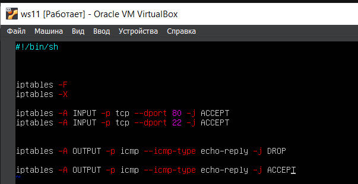

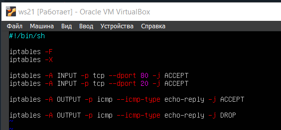

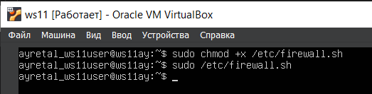

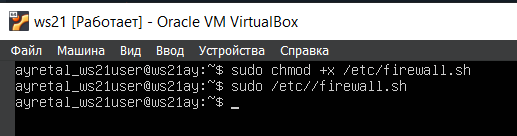

Разница между стратегиями заключается в том, что в первом файле первым подходящим правилом для пакета является запрет, а во втором - разрешение. Применяется только первое подходящее правило, остальные игнорируются.

#### 4.2. Утилита **nmap**
##### Командой **ping** найди машину, которая не «пингуется», после чего утилитой **nmap** покажи, что хост машины запущен.
*Проверка: в выводе nmap должно быть сказано: `Host is up`*.
- В отчёт помести скрины с вызовом и выводом использованных команд **ping** и **nmap**.
- 
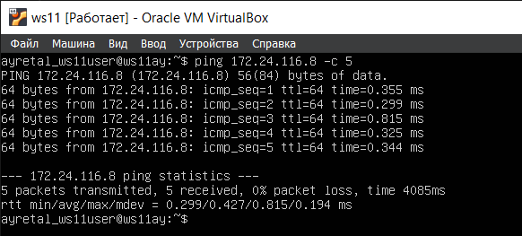

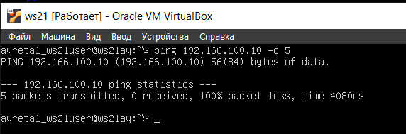

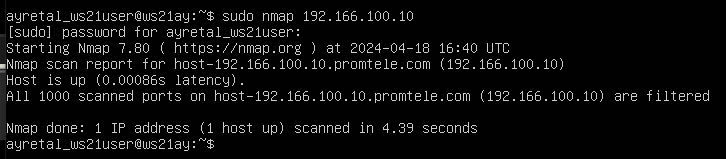

## Part 5. Статическая маршрутизация сети
Сеть: \


##### Подними пять виртуальных машин (3 рабочие станции (ws11, ws21, ws22) и 2 роутера (r1, r2)).

#### 5.1. Настройка адресов машин
##### Настрой конфигурации машин в *etc/netplan/00-installer-config.yaml* согласно сети на рисунке.
- В отчёт помести скрины с содержанием файла *etc/netplan/00-installer-config.yaml* для каждой машины.

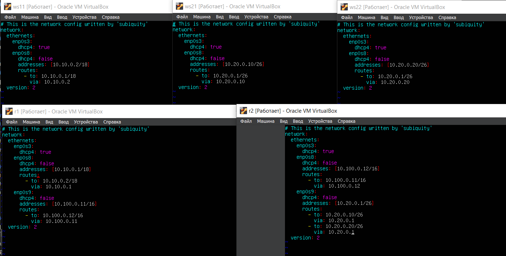

#### Перезапусти сервис сети. Если ошибок нет, то командой `ip -4 a` проверь, что адрес машины задан верно. Также пропингуй ws22 с ws21. Аналогично пропингуй r1 с ws11.

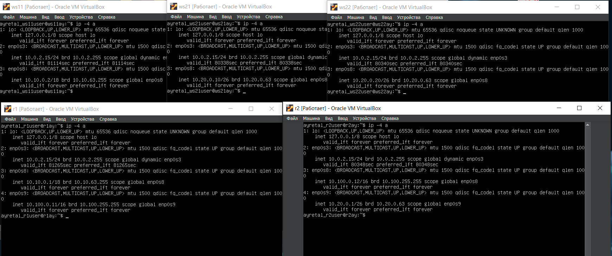

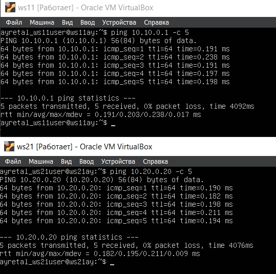

#### 5.2. Включение переадресации IP-адресов
##### Для включения переадресации IP, выполни команду на роутерах:
`sysctl -w net.ipv4.ip_forward=1`
*При таком подходе переадресация не будет работать после перезагрузки системы.*

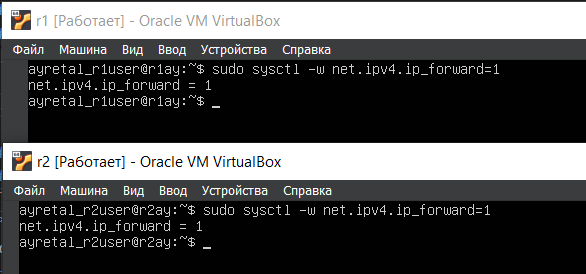

##### Открой файл */etc/sysctl.conf* и добавь в него следующую строку:
`net.ipv4.ip_forward = 1`
*При использовании этого подхода, IP-переадресация включена на постоянной основе.*

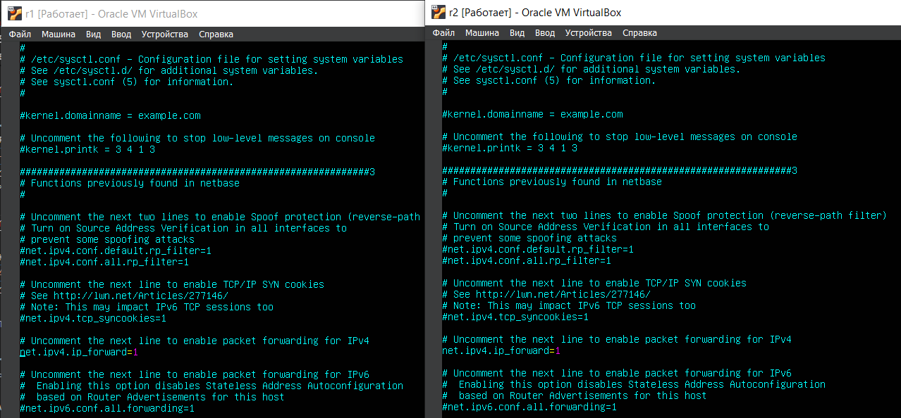

#### 5.3. Установка маршрута по-умолчанию
Пример вывода команды `ip r` после добавления шлюза:
```
default via 10.10.0.1 dev eth0
10.10.0.0/18 dev eth0 proto kernel scope link src 10.10.0.2
```
##### Настрой маршрут по-умолчанию (шлюз) для рабочих станций. Для этого добавь `default` перед IP роутера в файле конфигураций.

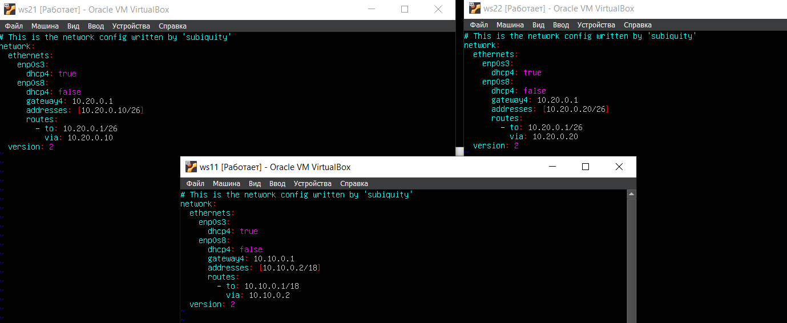

##### Вызови `ip r` и покажи, что добавился маршрут в таблицу маршрутизации.

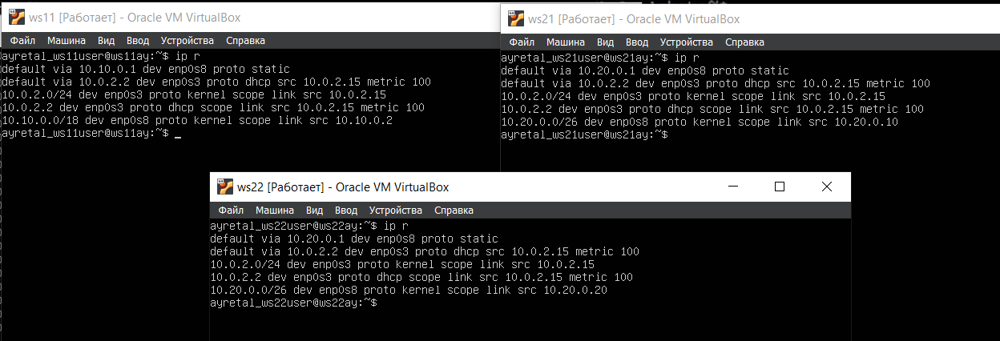

##### Пропингуй с ws11 роутер r2 и покажи на r2, что пинг доходит. Для этого используй команду:
`tcpdump -tn -i eth0`

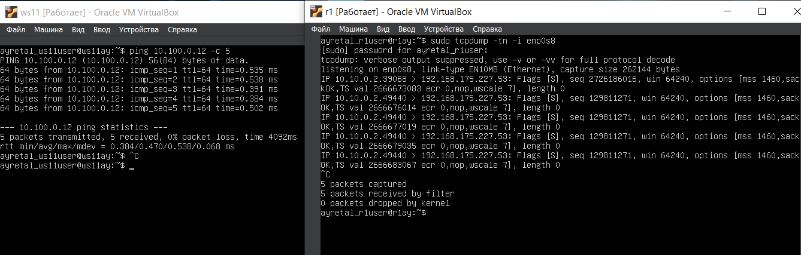

### 5.4. Добавление статических маршрутов
#### Добавь в роутеры r1 и r2 статические маршруты в файле конфигураций. Пример для r1 маршрута в сетку 10.20.0.0/26:
```shell
# Добавь в конец описания сетевого интерфейса eth1:
- to: 10.20.0.0
  via: 10.100.0.12
```
- В отчёт помести скрины с содержанием изменённого файла *etc/netplan/00-installer-config.yaml* для каждого роутера.

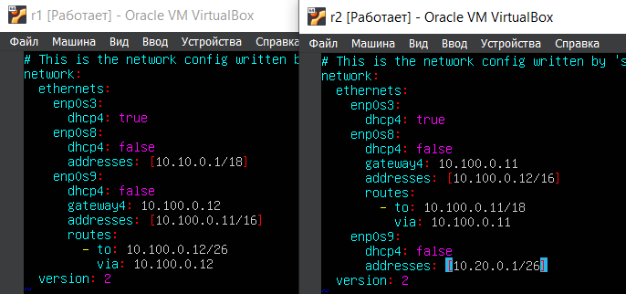

##### Вызови `ip r` и покажи таблицы с маршрутами на обоих роутерах. 

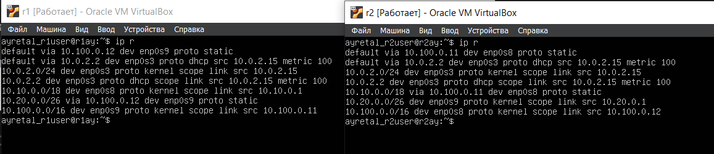

##### Запусти команды на ws11:
`ip r list 10.10.0.0/[маска сети]` и `ip r list 0.0.0.0/0`
- В отчёт помести скрин с вызовом и выводом использованных команд;
- В отчёте объясни, почему для адреса 10.10.0.0/\[маска сети\] был выбран маршрут, отличный от 0.0.0.0/0, хотя он попадает под маршрут по-умолчанию.

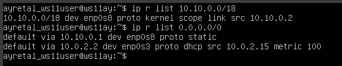

Маршрут по умолчанию имеет более низкий приоритет и срабатывает, когда не найден подходящий маршрут в таблице маршрутизации. Для сети 10.10.0.0 мы создали правило, соответственно используется созданный маршрут. Также можно устанавливать метрику, чтобы менять приоритеты маршрутов.

#### 5.5. Построение списка маршрутизаторов

#### Запусти на r1 команду дампа:
    tcpdump -tnv -i enp0s8
#### При помощи утилиты **traceroute** построй список маршрутизаторов на пути от ws11 до ws21.

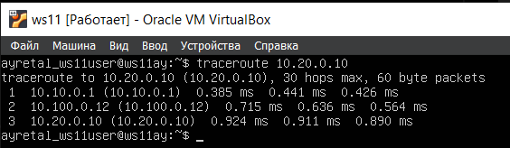

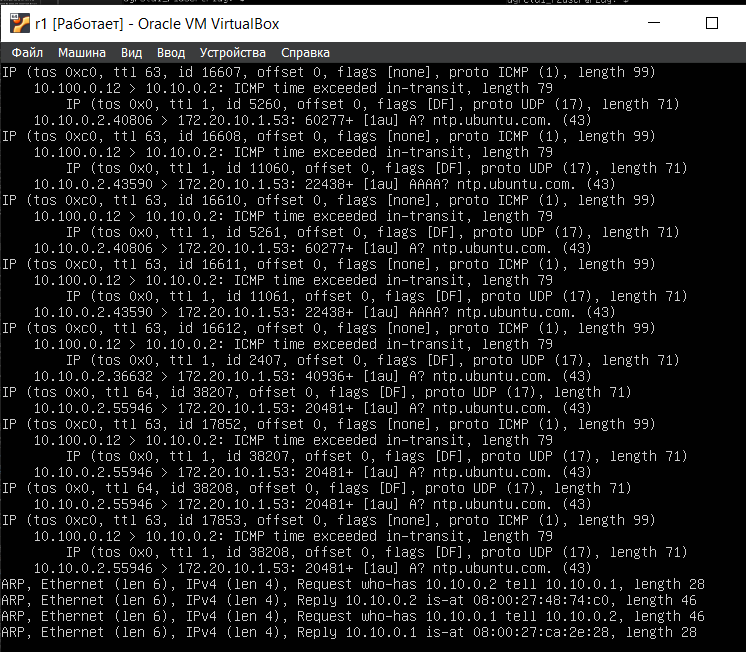

Принцип работы traceroute:

Для определения промежуточных маршрутизаторов traceroute отправляет целевому узлу серию ICMP-пакетов (по умолчанию 3 пакета), с каждым шагом увеличивая значение поля TTL («время жизни») на 1.

Первая серия пакетов отправляется с TTL, равным 1, и поэтому первый же маршрутизатор возвращает обратно ICMP-сообщение «time exceeded in transit», указывающее на невозможность доставки данных.

Traceroute фиксирует адрес маршрутизатора, а также время между отправкой пакета и получением ответа (эти сведения выводятся на монитор компьютера).

Затем traceroute повторяет отправку серии пакетов, но уже с TTL, равным 2, что заставляет первый маршрутизатор уменьшить TTL пакетов на единицу и направить их ко второму маршрутизатору.

Второй маршрутизатор, получив пакеты с TTL=1, так же возвращает «time exceeded in transit».

Процесс повторяется до тех пор, пока пакет не достигнет целевого узла.

При получении ответа от этого узла процесс трассировки считается завершённым.

#### 5.6. Использование протокола **ICMP** при маршрутизации
#### Запусти на r1 перехват сетевого трафика, проходящего через enp0s8 с помощью команды:
    tcpdump -n -i enp0s8 icmp
#### Пропингуй с ws11 несуществующий IP (например, *10.30.0.111*) с помощью команды:
    ping -c 1 10.30.0.111

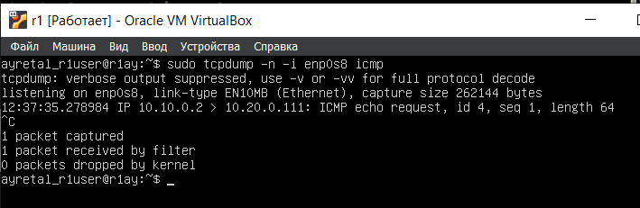

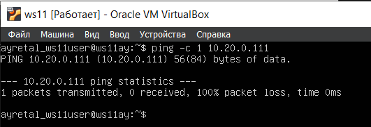

## Part 6. Динамическая настройка IP с помощью **DHCP**

#### Для r2 настрой в файле */etc/dhcp/dhcpd.conf* конфигурацию службы **DHCP**:
#### 1) Укажи адрес маршрутизатора по-умолчанию, DNS-сервер и адрес внутренней сети. Пример файла для r2:

    subnet 10.100.0.0 netmask 255.255.0.0 {}

    subnet 10.20.0.0 netmask 255.255.255.192
    {
        range 10.20.0.2 10.20.0.50;
        option routers 10.20.0.1;
        option domain-name-servers 10.20.0.1;
    }

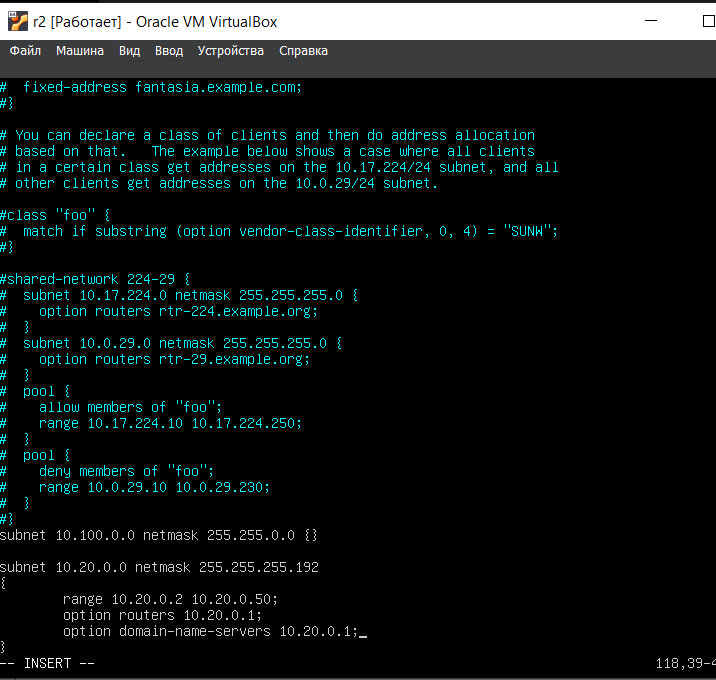


##### 2) В файле *resolv.conf* пропиши `nameserver 8.8.8.8`.

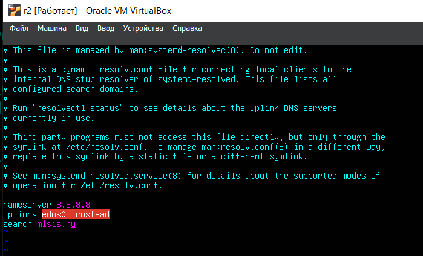

#### Перезагрузи службу **DHCP** командой `systemctl restart isc-dhcp-server`. Машину ws21 перезагрузи при помощи `reboot` и через `ip a` покажи, что она получила адрес. Также пропингуй ws22 с ws21.

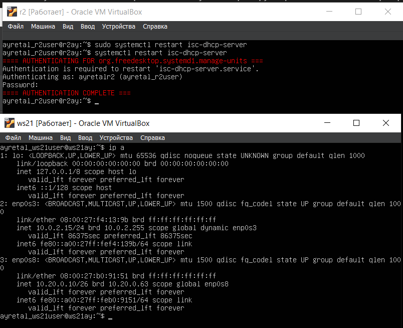

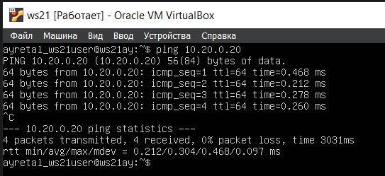

#### Укажи MAC адрес у ws11, для этого в *etc/netplan/00-installer-config.yaml* надо добавить строки: `macaddress: 10:10:10:10:10:BA`, `dhcp4: true`.

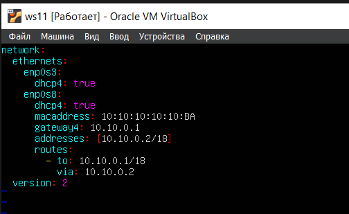

#### Для r1 настрой аналогично r2, но сделай выдачу адресов с жесткой привязкой к MAC-адресу (ws11). Проведи аналогичные тесты.


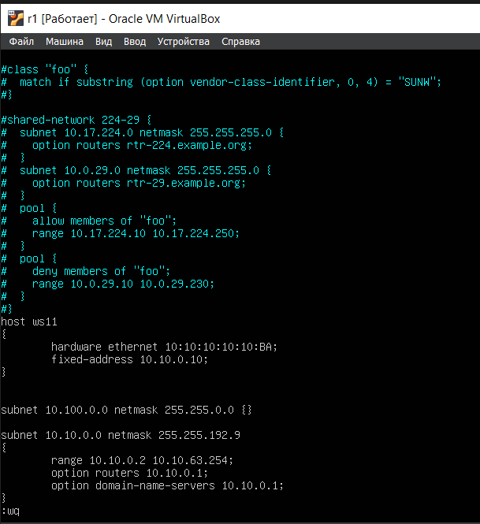

    hardware ethernet — фактический MAC адрес того интерфейса, для которого последует настройка
    fixed-address — IP адрес который будет назначен интерфейсу

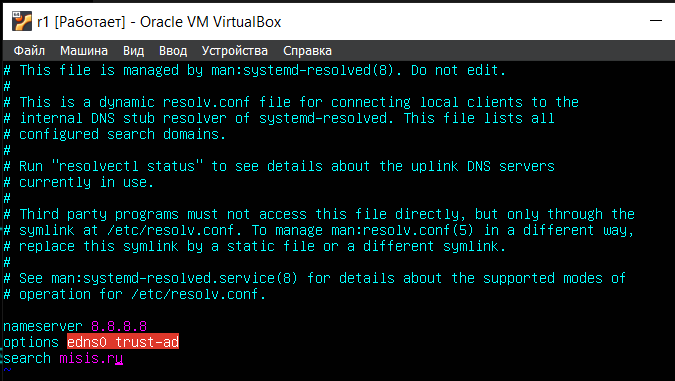

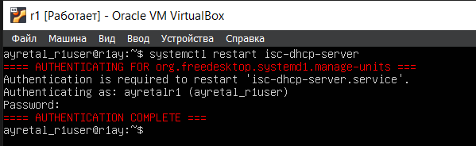


#### Запроси с ws21 обновление ip адреса.

  В отчёте помести скрины ip до и после обновления.

    sudo dhclient enp0s8 -r удалить IP
    sudo dhclient enp0s8 добавить IP
    ip a

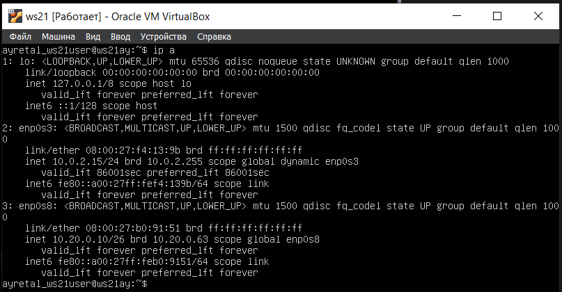

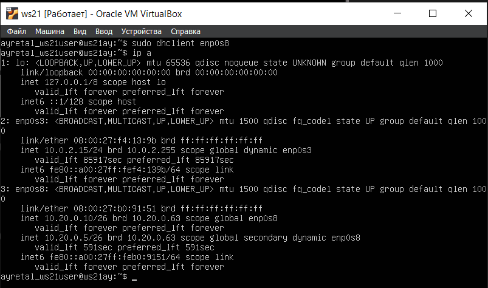

## Part 7. **NAT**

#### В файле */etc/apache2/ports.conf* на ws22 и r1 измени строку `Listen 80` на `Listen 0.0.0.0:80`, то есть сделай сервер Apache2 общедоступным.


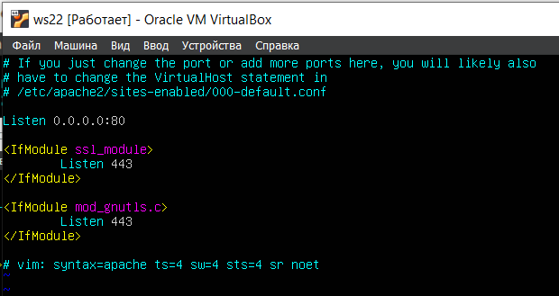

#### Запусти веб-сервер Apache командой `service apache2 start` на ws22 и r1.

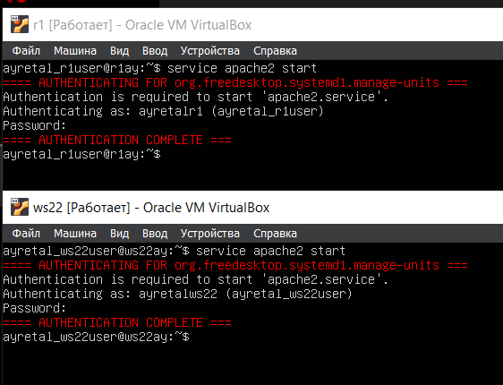

##### Добавь в фаервол, созданный по аналогии с фаерволом из Части 4, на r2 следующие правила:
##### 1) Удаление правил в таблице filter - `iptables -F`;
##### 2) Удаление правил в таблице "NAT" - `iptables -F -t nat`;
##### 3) Отбрасывать все маршрутизируемые пакеты - `iptables --policy FORWARD DROP`.

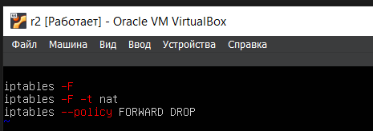

##### Запусти файл также, как в Части 4.

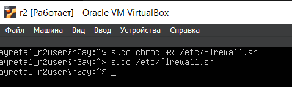

#### Проверь соединение между ws22 и r1 командой `ping`.
*При запуске файла с этими правилами, ws22 не должна «пинговаться» с r1.*

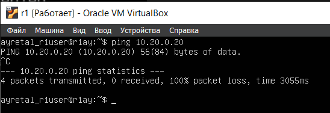

#### Добавь в файл ещё одно правило:
#### 4) Разрешить маршрутизацию всех пакетов протокола **ICMP**.

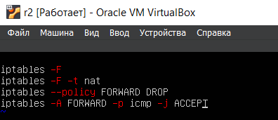

#### Проверь соединение между ws22 и r1 командой `ping`.
*При запуске файла с этими правилами, ws22 должна «пинговаться» с r1.*

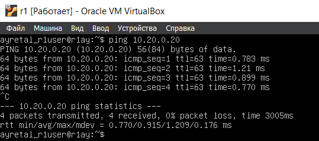

#### Добавь в файл ещё два правила:
#### 5) Включи **SNAT**, а именно маскирование всех локальных ip из локальной сети, находящейся за r2 (по обозначениям из Части 5 - сеть 10.20.0.0).
*Совет: стоит подумать о маршрутизации внутренних пакетов, а также внешних пакетов с установленным соединением.*
#### 6) Включи **DNAT** на 8080 порт машины r2 и добавить к веб-серверу Apache, запущенному на ws22, доступ извне сети.
*Совет: стоит учесть, что при попытке подключения возникнет новое tcp-соединение, предназначенное ws22 и 80 порту.*

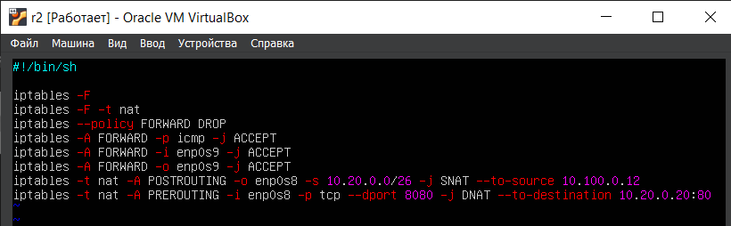

    С помощью ключа -t (более длинный вариант --table) можно указать имя таблицы для сохранения. Если ключ -t не задан, то сохраняются все таблицы.

    SNAT - Source Network Address Translation - изменение адреса и порта источника пакета, доступен в цепочке POSTROUTING

    iptables -t nat -A POSTROUTING -o enp0s8 10.20.0.0/26 -j SNAT --to-source 10.100.0.12: Эта строка добавляет правило в цепочку POSTROUTING таблицы nat. Пакеты, идущие на интерфейс enp0s8 с исходным адресом 10.20.0.0/26, проходят действие SNAT, которое заменяет исходный IP адрес на 10.100.0.12.

    iptables -t nat -A PREROUTING -i enp0s9 --dport 8080 -j DNAT --to-destination 10.20.0.20:80: Эта строка добавляет правило в цепочку PREROUTING таблицы nat. Пакеты, поступающие на интерфейс enp0s9 на порт 8080, проходят действие DNAT, которое заменяет назначенный IP адрес на 10.20.0.20 и порт на 80.

#### Запусти файл также, как в Части 4.
*Перед тестированием рекомендуется отключить сетевой интерфейс **NAT** (его наличие можно проверить командой `ip a`) в VirtualBox, если он включен.*
#### Проверь соединение по TCP для **SNAT**: для этого с ws22 подключиться к серверу Apache на r1 командой:
`telnet [адрес] [порт]`
#### Проверь соединение по TCP для **DNAT**: для этого с r1 подключиться к серверу Apache на ws22 командой `telnet` (обращаться по адресу r2 и порту 8080).
- В отчёт помести скрины с вызовом и выводом использованных команд.

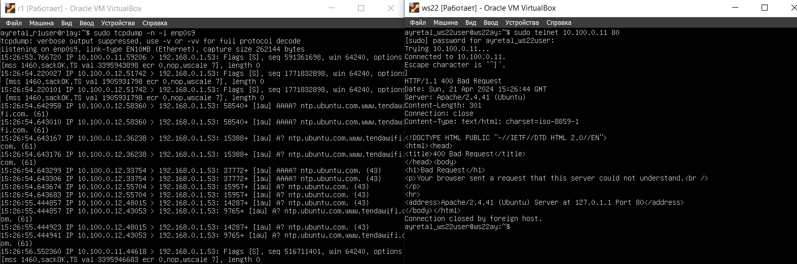

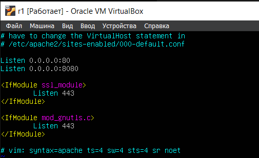

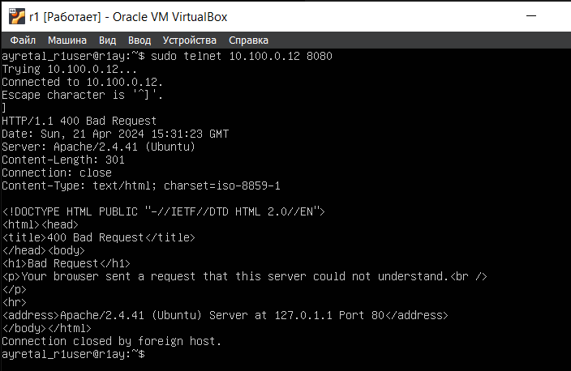

## Part 8. Дополнительно. Знакомство с **SSH Tunnels**

#### Запусти на r2 фаервол с правилами из Части 7.
#### Запусти веб-сервер **Apache** на ws22 только на localhost (то есть в файле */etc/apache2/ports.conf* измени строку `Listen 80` на `Listen localhost:80`).

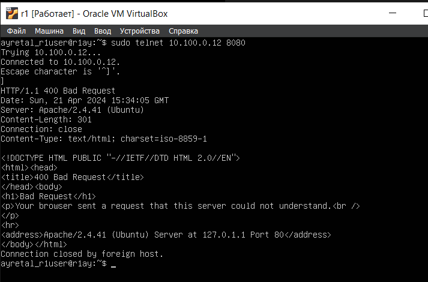

#### Воспользуйся *Local TCP forwarding* с ws21 до ws22, чтобы получить доступ к веб-серверу на ws22 с ws21.

    Переброс локального порта
    Локальная пересылка представляет собой переброс порта из клиентской системы на сервер. Он позволяет настроить порт в системе таким образом, чтобы все соединения на этот порт проходили через туннель SSH.

    Для переадресации локального порта используется ключ L. Общий синтаксис команды таков:

    ssh -L [LOCAL_IP:]LOCAL_PORT:DESTINATION:DESTINATION_PORT [USER@]SSH_SERVER

    Используются следующие параметры:

    [LOCAL_IP:]LOCAL_PORT — IP-адрес и номер порта локального компьютера. Если LOCAL_IP опущен, клиент ssh привязывается к локальному хосту.

    DESTINATION:DESTINATION_PORT — IP или имя хоста и порт конечного компьютера.

    [USER@]SERVER_IP — удаленный пользователь SSH и IP-адрес сервера.
    В качестве LOCAL_PORT можно использовать любой порт с номером больше 1024 . Порты с номерами меньше 1024 являются привилегированными и могут использоваться только пользователем root. Если ваш SSH-сервер прослушивает порт, отличный от 22 (по умолчанию), используйте параметр -p [PORT_NUMBER] .

    Имя хоста назначения должно разрешаться с сервера SSH.


    ssh -L 4444:localhost:80 10.20.0.20

#### Воспользуйся *Remote TCP forwarding* c ws11 до ws22, чтобы получить доступ к веб-серверу на ws22 с ws11.

    В Linux, macOS и других системах Unix для создания удаленного перенаправления портов передайте параметр -R клиенту ssh 

    -R [REMOTE:]REMOTE_PORT:DESTINATION:DESTINATION_PORT [USER@]SSH_SERVER

    Используются следующие параметры:

    [REMOTE:]REMOTE_PORT — IP-адрес и номер порта на удаленном SSH-сервере. Пустой REMOTE означает, что удаленный SSH-сервер будет связываться со всеми интерфейсами.

    DESTINATION:DESTINATION_PORT — IP или имя хоста и порт конечного компьютера.

    [USER@]SERVER_IP — удаленный пользователь SSH и IP-адрес сервера.
    Удаленная переадресация портов в основном используется для предоставления доступа к внутренней службе кому-либо извне.

    ssh -R 4444:localhost:80 10.20.0.20

#### Для проверки, сработало ли подключение в обоих предыдущих пунктах, перейди во второй терминал (например, клавишами Alt + F2) и выполни команду:
`telnet 127.0.0.1 [локальный порт]`
- В отчёте опиши команды, необходимые для выполнения этих четырёх пунктов, а также приложи скриншоты с их вызовом и выводом.


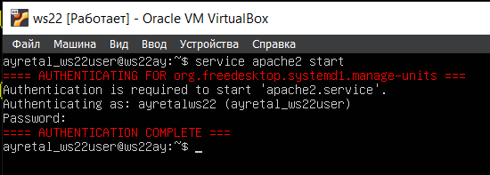

